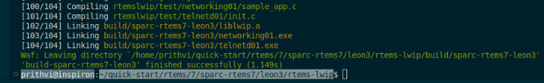
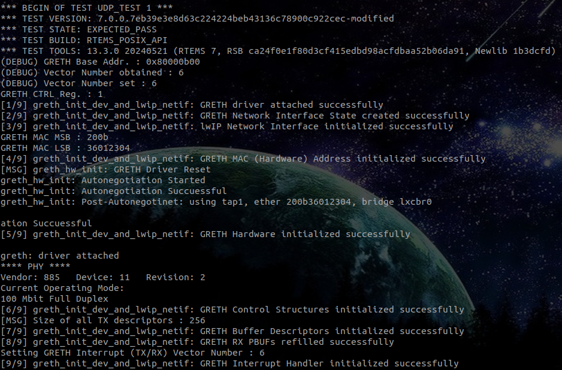
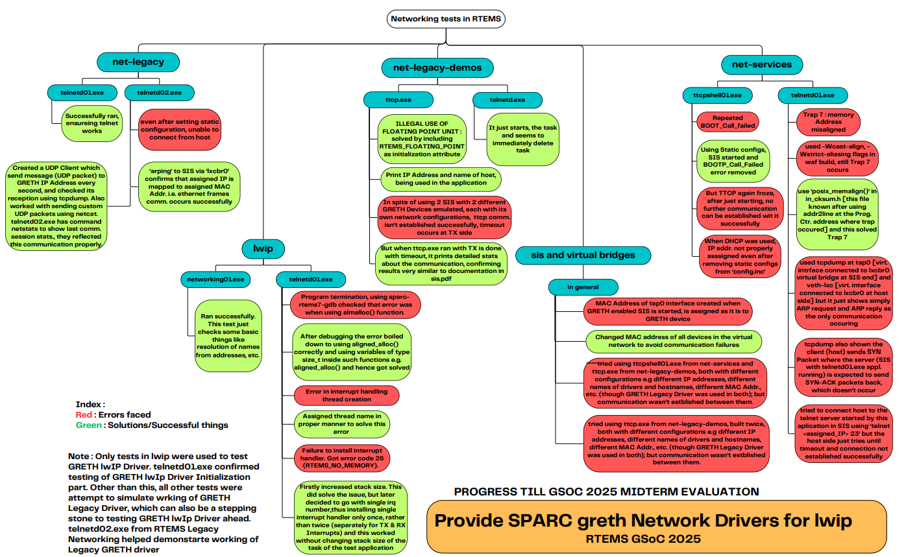

# GRETH lwIP

# Important links

- Project Proposal : https://docs.google.com/document/d/1KLlMjdrkfGR3_HONQxrabDRVJW1kofIOX414PjWlTHs/edit?tab=t.0
- GitLab Epic : [https://gitlab.rtems.org/groups/rtems/-/epics/28](https://gitlab.rtems.org/groups/rtems/-/epics/28)
- Activity : [https://gitlab.rtems.org/prithvi77](https://gitlab.rtems.org/prithvi77)
- GitLab Issue : [https://gitlab.rtems.org/rtems/programs/gsoc/-/issues/77](https://gitlab.rtems.org/rtems/programs/gsoc/-/issues/77)
- Final GSoC Work MR Link : https://gitlab.rtems.org/rtems/pkg/rtems-lwip/-/merge_requests/29
- GRETH lwIP Driver latest state with tests at branch : https://gitlab.rtems.org/prithvi77/rtems-lwip/-/tree/GSoC-25-Final-Work-Tests?ref_type=heads
- Documentation : https://gitlab.rtems.org/rtems/docs/rtems-docs/-/merge_requests/192

# Goal

The GRETH Ethernet Driver in RTEMS is based on the Legacy TCP/IP Networking Stack, however, it is bit outdated. Nowadays, several RTEMS Applications work on newer networking stacks like lwIP, owing to its several benefits, like smaller memory footprint, flexible APIs, etc. However, GRETH is, right now, incompatible with the lwIP networking stack and this project aims to solve this exact issue by porting the GRETH Driver to lwIP. The porting involves restructuring the GRETH driver to be integrated with lwIP. This includes implementing essential components such as packet handling, interrupt mechanisms, and setup procedures for network initialization. In addition, this project also involves creation of tests for evaluating the operation of the driver.

# Work Done till now

## GRETH lwIP Driver Initialization

- Before this project, RTEMS lwIP Package did not have support for GRETH as well as for `sparc/leon3` BSP. My first milestone for my GSoC project was to provide support for `sparc/leon3` BSP by starting to write GRETH Driver for RTEMS lwIP Networking Stack, thus building this package for the first time for GRETH as well as `sparc/leon3` BSP. I feel very happy to tell that with the new code for RTEMS lwIP GRETH Driver, and after days of debugging and fixing warnings and errors, the lwIP Networking Stack now builds successfully, without even any warnings!
    
    
    

- The initialization of the GRETH lwIP Driver has been tested using `printf()` statements at various phases in the driver code, and using `telnetd01.exe` application from RTEMS lwIP itself, being run in SIS.

## GRETH lwIP non-Gigabit TX

- This is the first feature completely implemented and tested for GRETH lwIP Driver.
- This involves transmitting packets at either 10/100 Megabit speed, either full/half duplex mode, decided by autonegotiation between 2 connecting PHY chips.
- The code for GRETH lwIP driver transmission mechanism, along with required interrupt handling for transmission mechanism, is written keeing in mind the working as studied from GRETH Legacy Driver, in RTEMS Legacy Networking, and various learnings from TMS570 Ethernet Driver in RTEMS lwIP.
- The commit ID at which the successful build with the whole transmission mechanism was first noted is (clickable link): [`337b7f570fd02a3618dfe0f6d3df316ebbc042d4`  on branch `Prithvi-GSoC-25`](https://gitlab.rtems.org/prithvi77/rtems-lwip/-/commit/337b7f570fd02a3618dfe0f6d3df316ebbc042d4)
- Further, I wrote an elaborate test as a part of testing the non gigabit transmission operation of the GRETH lwIP Driver :
- This test created a UDP socket and sent simple strings like “This is message no. 1”, “This is message no. 2”, and so on, every second, to a specified destination IP address and a destination port number. At the time, since reception functionality wasn’t implemented yet, what was expected was that the transmitter (GRETH) will broadcast ARP requests for the destination in an attempt to establish communication. Here, it was not necessary for destination to be up, since, as GRETH drive didn’t have reception functionality, it anyways couldn’t receive any ARP replies even if destination was up.
- These ARP requests were observed successfully on wireshark on bridge lxcbr0, originating from the IP address assigned to transmitter GRETH lwIP driver, confirming non-gigabit transmission mechanism operation.
- This was unicast communication test and it was made by me referring this test : https://github.com/joelsherrill/rtems-networking-tests/blob/main/mcast_client/mcast_client.c
- [Test 1 Link](https://gitlab.rtems.org/prithvi77/rtems-lwip/-/blob/GSoC-25-Final-Work-Tests/rtemslwip/test/tx_udp/init.c?ref_type=heads)
- Later on, once receive functionality was made, I worked one step ahead, to create a test creating a UDP socket on Linux Host, listening to messages from GRETH lwIP transmitter. This test also succeeded!
- [Test 2 Link](https://github.com/rkt-1597/rtems-networking-tests/blob/Prithvi-GSoC-2025/ucast_server/ucast_server.c)
- [TX-nongbit-video-demonstration (Clickable link)](assets/tx_nongbit.mp4)
- The tests verified that the limited number of descriptors (here, 32 descriptors) are effectively cycled through to allow transmission of a continuous stream of packets.

## GRETH lwIP RX

- The next feature I worked on was implementing packet reception mechanism on GRETH lwIP Driver
- Packet reception has just single mechanism in GRETH driver, unlike packet transmission having 2 mechanisms, one for Gigabit transmission and other, for non-Gigabit transmission.
- After writing the algorithm for packet reception mechanism, I also wrote a test, which runs utilizing GRETH lwIP driver, to create a UDP socket for receiver end, and listens packets. Next, I created another test, which creates a UDP socket on Linux host and transmits UDP messages which are strings like “This is message no. 1”, “This is message no. 2”, and so on, every second, to the IP addresss assiged to GRETH lwIP receiver, and the test running on GRETH lwIP receiver successfully printed the received message.
- The GRETH lwIP Driver’s reception mechanism is also observed to be able to receive a continuous stream of packets, by reallocating pbufs of the descriptors.
- [Test 1 Link](https://gitlab.rtems.org/prithvi77/rtems-lwip/-/blob/GSoC-25-Final-Work-Tests/rtemslwip/test/rx_udp/init.c?ref_type=heads)
- [Test 2 Link](https://github.com/rkt-1597/rtems-networking-tests/blob/Prithvi-GSoC-2025/ucast_client/ucast_client.c)
- [rx-greth-video](assets/rx_greth.mp4)

## GRETH lwIP Gigabit TX

- The code/algorithm for GRETH lwIP Driver gigabit transmission is completely ready
- The tests used for testing non-gigabit transmission are intended to be used for testing Gigabit transmission as well.
- However, on testing, some issues were observed with the Gigabit TX mechanism; the latest issue is that even thoug 32 bufffer descriptors are allocated for transmission, and even with padding, 2 descriptors are used per packet, in theory, the escriptors should get exhausted 16 packets later, but the descriptors are getting exhausted just 11 packets later!  

# Bugs faced

Over the course of GSoC, I faced several bugs. Some of them are :   

1. BOOTP Failed error : The BOOTP protocol failed, when I was trying to operate GRETH LEgacy Driver on RTEMS SIS. Ths was probably due to any BOOTP configuration not obtained dynamically. Using static configuration helped solve that issue since by that time a lot of time was gone trying to identify the issue itself.

2. Trap 7 (Memory Address Misaligned) : This was solved, especially in new GRETH lwIP Driver, using `__attribute((aligned(8)));`  

3. Tap interface not being created for GRETH lwIP Driver : This was due to MAC Address set much later after RX Enable flag was set in Control Register, which was opposite to what SIS expected. Interchaning this order in the code solved the issue. 

# Debugging Performed using various RTEMS tests : 

# Way ahead

This project is a really ambitious one; it has great future scope ahead. Several things can be enhanced here, starting with completing testing GRETH Gigabit Transmission mechansim. Once this is done, the driver can be said to be tested for all of its capabilities

# Summary of contributions

1. Documentation of GRETH Legacy Driver : As I was studying GRETH Legacy Driver, I thought it would be a good idea to try DOxygen documentation, hence gaining hands-on experience in it as well as reinforcing my learnings. https://gitlab.rtems.org/prithvi77/rtems-net-legacy/-/blob/greth-legacy-notes/bsps/shared/net/greth2.c?ref_type=heads
2. Partial Doxygen Documentation of GRETH Legacy Driver : As I was studying TMS570 lwIP Ethernet driver, I thought to make notes in the form of Doxygen Comments, thus reinforcing my learning of the driver. Here is the documentation I made : https://gitlab.rtems.org/prithvi77/rtems-lwip/-/blob/TMS570_lwIP_Documentation/rtemslwip/tms570/tms570_netif.c?ref_type=heads
3. leon: Include leon.h to resolve undefined leon_r32_no_cache @ RTOS/RTEMS : I made this MR during the GSoC Period to include leon.h in bsp.h at rtems/bsps/sparc/leon3/include ensures that the function leon_r32_no_cache() is recognized. This prevents “undefined reference” errors for leon_r32_no_cache(). MR Link : https://gitlab.rtems.org/rtems/rtos/rtems/-/merge_requests/485
4. leon3: Use sreload @ Packages/Legacy Networking : This Merge Request is regarding implementing correct LEON3 timer scaler reload register access by replacing scaler_reload with the proper sreload field. MR Link : https://gitlab.rtems.org/rtems/pkg/rtems-net-legacy/-/merge_requests/22

# Methods of testing

These tests have been tested on `Ubuntu 22.04.5 LTS (jammy)`

1. Installing RTEMS : Follow these steps to install RTEMS. Here, the installation prefix chosen is `$HOME/quick-start/rtems/7`.
    + Clone the repositories to obtain the sources
      
        `>>> mkdir -p $HOME/quick-start/src`
        
        `>>> cd $HOME/quick-start/src `
        
        `>>> git clone https://gitlab.rtems.org/rtems/tools/rtems-source-builder.git rsb  `
        
        `>>> git clone https://gitlab.rtems.org/rtems/rtos/rtems.git`  
    +  Installing the Tool Suite :  
    `>>> cd $HOME/quick-start/src/rsb/rtems` 
      
        `>>> ../source-builder/sb-set-builder --prefix=$HOME/quick-start/rtems/7 7/rtems-sparc`  
    + Build the Board Support Package, for this GSoC project, BSP is `sparc/leon3`  
    `>>> cd $HOME/quick-start/src/rsb/rtems`  
    `>>> ../source-builder/sb-set-builder --prefix=$HOME/quick-start/rtems/7 \`  
    `--target=sparc-rtems7 --with-rtems-bsp=sparc/erc32 --with-rtems-tests=yes 7/rtems-kernel`  

    + With this, we have built RTEMS and also our required BSP!

2. To create virtual bridge `lxcbr0` :   
`lxcbr0` is a virtual bridge. When an application, which uses GRETH, is runnning in SIS, a tap device is automatically created when the application enables the GRETH core. The tap can optionally be connected to a host bridge using -bridge br0 or similar at invocation. Networking requires SIS to be run as root or with `sudo`. To create this bridge : 

    + Install `lxc` package :   
    `>>> sudo apt install lxc`  
    + Set the following configurations in file `/etc/default/lxc-net` :   
    `USE_LXC_BRIDGE="true"`   
    `LXC_BRIDGE="lxcbr0"`  
    `LXC_ADDR="10.0.3.1"`  
    `LXC_NETMASK="255.255.255.0"`  
    `LXC_NETWORK="10.0.3.0/24"`  
    `LXC_DHCP_RANGE="10.0.3.2,10.0.3.254"`  
    `LXC_DHCP_MAX="253"`  
    `LXC_DHCP_CONFILE=""`  
    `LXC_DOMAIN="lxc"`
    using the command :  
    `>>> sudo nano /etc/default/lxc-net`
    + Now run the following command to start the virtual bridge `lxcbr0` :  
    `>>> sudo systemctl start lxc-net`  
    + To stop the bridge `lxcbr0` use the following command :  
    `>>> sudo systemctl stop lxc-net`

3. Starting the SIS terminal : 

    + Clone the GitLab repository for RTEMS-SIS :  
    `>>> git clone https://gitlab.rtems.org/rtems/tools/rtems-sis`
    + Move to `rtems-sis` directory  
    `>>> cd rtems-sis`  
    + SIS uses `make` build system. Run the following command to build SIS  
    `>>> ./configure`  
    `>>> make`
    + (optional) Further, to generate doccumentation for SIS, to generate a file `sis.pdf`, run :  
    `>>> make sis.pdf`  
    + Now you will be having an executable file : `sis`. To start it, run (`-v` option enables higher verbosity; it is an optional flag) :  
    `>>> sudo ./sis -v -leon3 -bridge lxcbr0 ./<application-file-name>`
    + To run your application, use the command in SIS terminal:  
    `>>> run`  
    + The application should start running

4. To build RTEMS packages like : [Legacy Networking](https://gitlab.rtems.org/rtems/pkg/rtems-net-legacy), [lwIP](https://gitlab.rtems.org/rtems/pkg/rtems-lwip) or [Net Services](https://gitlab.rtems.org/rtems/pkg/rtems-net-services), follow these steps : 

    + Clone the GitLab repository :  
    `>>> git clone <repository-link-http-type>`  
    + Move inside the cloned repository :  
    `>>> cd <cloned-repository>`  
    + First, populate the git submodules :  
    `>>> git submodule init`  
    `>>> git submodule update` 
    + All these packages use `waf` build system. So, toi use this build system, follow these steps :  
    1. Confgure the workspace. Here, `INSTALL_PREFIX` is the [path where RTEMS is installed](https://docs.rtems.org/docs/main/user/start/prefixes.html#quickstartprefixes) :  
    `>>>./waf configure --prefix=INSTALL_PREFIX --rtems-bsps sparc/leon3`  
    2. Build the package :  
    `>>> ./waf build`  
    3. Install the package :  
    `>>> ./waf install`  

    For [Legacy Networking Demos](https://gitlab.rtems.org/rtems/pkg/rtems-net-legacy-demos), this process is a bit different since it uses `make` build system. To build it, follow these steps :    
    + Clone the GitLab repository :  
    `>>> git clone <repository-link-http-type>`  
    + Move inside the cloned repository :  
    `>>> cd <cloned-repository>`
    + Set variables (for `rtems-installation-prefix` check previous part) :  
    `>>> export RTEMS_MAKEFILE_PATH=<rtems-install-prefix>/sparc-rtems7/leon3`  
    `>>> export PROJECT_ROOT=<rtems-install-prefix>`  
    + Then build the package :  
    `>>> make`

5. Using tests from RTEMS Packages in SIS : Once RTEMS Packages are built, tests can be found at : 
    + In Legacy Networking :  
    `rtems-net-legacy/build/sparc-rtems7-leon3/testsuites/<test-name>/<test>.exe`  
    + In Legacy Networking Demos :  
    `rtems-net-legacy-demos/<test-name>/o-optimize/<test>.exe`  
    [e.g. tests like ttcp, telnetd, etc.]  
    + In Net Services :  
    `rtems-net-services/buils/sparc-rtems7-leon3/<test>.exe`  
    + In lwIP :  
    `rtems-lwip/build/sparc-rtems7-leon3/<test>.exe`

6. Tests in `rtems-networking-tests` GitHub repository are intended to be run on Linux host, to test TX/RX functionality of GRETH lwIP driver. The tests required from this repository are `ucast_client` when testing GRETH lwIP Receiver and `ucast_server`, when testing GRETH lwIP transmitter. Hence, here, `TEST_NAME` is either `ucast_server` or `ucast_client`. To use these tests, follow these instructions :   
    + Change directory to the test `TEST_NAME` directory  
    `>>> cd rtems-networking-tests/TEST_NAME`  
    + Clean any previous build results  
    `>>> make clean`  
    + Build the test using `make` command  
    `>>> make`  
    + Now, you will obtain an executable of the name `TEST_NAME`. Run it using :  
    `>>> ./TEST_NAME`  
    + `ucast_server` will start a listener on the IP address and port printed on terminal screen and hence can be used to test GRETH lwIP Driver Transmission functionality. It will print any received messages.  
    + `ucast_client` will start a sender on the IP address and port printed on terminal screen and hence can be used to test GRETH lwIP Driver Reception functionality. It will print the messages it sends every second as well as the destination IP address and port number to which it is sending data.  

7. Using tests in RTEMS lwIP Package is a bit different. The relevant tests (and which I made during GSoC period) lie at `rtems-lwip/rtemslwip/test/tx_udp/init.c` and `rtems-lwip/rtemslwip/test/rx_udp/init.c`. Upon building RTEMS lwIP Package they get built into executables `tx_udp.exe` and `rx_udp.exe`, both lying at `rtems-lwip/build/sparc-rtems7-leon3/`.  At this stage it is assumed that you have cloned [RTEMS lwIP Package](https://gitlab.rtems.org/rtems/pkg/rtems-lwip)
    + The test `tx_udp.exe` is intended for testing transmission functionality of GRETH lwIP Driver. It creates a UDP socket on a specified IP address and port number and it then starts transmitting UDP packets carrying simple messages like "Message No. 1", "Message No. 2", and so on.   
    + This test also includes option of configuring Static or Dynamic ARP; it can be controlled by commenting out the unrequired macro out of `GRETH_STATIC_ARP` or `GRETH_DYN_ARP` in `rtems-lwip/rtemslwip/greth/include/lwipbspopts.h`. The IP addresses and port number used in the test can be configured by the user in any of the 4 configurable regions marked by comments like `/*...*/` in `rtems-lwip/rtemslwip/test/tx_udp/init.c`.  
    + In addition, this test also bears an extra option which can be used for testing Gigabit TX functionality of the driver - `GRETH_GBIT_TEST`. Setting this sets various internal flags to the values that should be when the driver oprtates in Gigabit TX mode. This macro is present in `rtems-lwip/rtemslwip/greth/include/greth_netif.h` and is useful because, in general, the driver, after autonegotiation, operates at 100 MBit Full Duplex mode.  
    + The test `rx_udp.exe` is intended for testing reception functionality of GRETH lwIP Driver. It creates a UDP socket on a specified IP address and port number and it then starts a receiver on that IP Address and Port. It listens to any packets on that IP address and port.   
    + This test also includes option of configuring Static or Dynamic ARP; it can be controlled by commenting out the unrequired macro out of `GRETH_STATIC_ARP` or `GRETH_DYN_ARP` in `rtems-lwip/rtemslwip/greth/include/lwipbspopts.h`. The IP addresses and port number used in the test can be configured by the user in any of the 4 configurable regions marked by comments like `/*...*/` in `rtems-lwip/rtemslwip/test/rx_udp/init.c`.      
    + It is a good practice to have LWIP debug options ON before suing the tests, as they will be helpful in tracing any bugs, in case the tests fail. For this, create a new file `config.ini` inside RTEMS lwIP Package (`rtems-lwip` directory) and copy the following code in it : 

            `[sparc/leon3]`  
            `LWIP_DEBUG=LWIP_DBG_ON`  
            `API_MSG_DEBUG=LWIP_DBG_ON`  
            `ETHARP_DEBUG=LWIP_DBG_ON`  
            `IP_DEBUG=LWIP_DBG_ON`

    + Building these tests :  Simply build the RTEMS lwIP Package. The tests will be built in `rtems-lwip/build/sparc-rtems7-leon3/`  
    `>>>./waf configure --prefix=INSTALL_PREFIX --rtems-bsps sparc/leon3`   
    `>>> ./waf clean`  
    `>>> ./waf build`  
    `>>> ./waf install`  
    + Once the tests are built, copy them from `rtems-lwip/build/sparc-rtems7-leon3/` to `rtems-sis` i.e. RTEMS SIS directory (where SIS is built and SIS executable is available) and run the following commands :  here it is assumed the current directory is `rtems-lwip` and `rtems-sis` is just at the same level as `rtems-lwip`. Also, process is same for `rx_udp.exe`, though, `tx_udp.exe` is shown here.
        
        `>>> cp build/sparc-rtems7-leon3/tx_udp.exe ../rtems-sis`  
        `>>> cd ../rtems-sis`  
        `>>> sudo ./sis -v -leon3 -bridge lxcbr0 ./tx_udp.exe`  

    + Now, if `tx_udp.exe` is running in 1 terminal, in another, run `ucast_server` test as follows.  :  
        `>>> ./ucast_server`       

        Successful test will show the messages transmitetd by `tx_udp.exe` being received by `ucast_server`  

    + Now, if `rx_udp.exe` is running in 1 terminal, in another, run `ucast_client` test as follows.  :  
        `>>> ./ucast_client`       

        Successful test will show the messages transmitetd by `ucast_client` being received by `rx_udp.exe`  

# Conclusion
I am sincerely grateful for the opportunity to participate in Google Summer of Code 2025. This program has been an invaluable learning experience, allowing me to enhance my technical skills, gain hands-on experience in open-source development, and understand the importance of collaboration and mentorship. I would like to thank my mentors Pavel Pisa, Vijay Banerjee, Kinsey Moore and Matteo Concas and the community for their guidance and support throughout the project. This experience has not only strengthened my knowledge but also inspired me to continue contributing to open-source projects in the future.